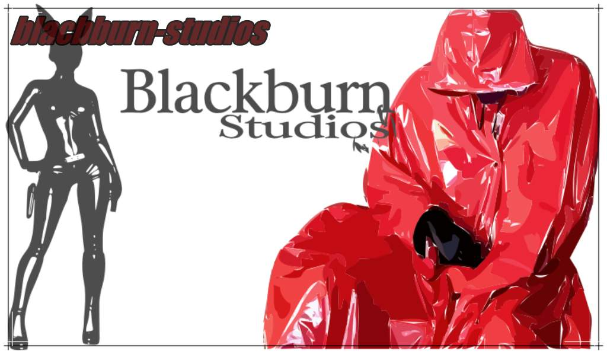

 
  

  &#xa0;

  <!-- <a href="https://april22.netlify.app">Demo</a> -->

<h1 align="center">April22</h1>

  

  

  

  

  <!--  -->

  <!--  -->

  <!--  -->

<!-- Status -->

<!-- <h4 align="center"> 
	🚧  April22 🚀 Under construction...  🚧
</h4> 

 -->

## About

Describe your project

This project is under license from MIT. For more details, see the [LICENSE](LICENSE.md) file.

Made with :heart: by <a href="https://github.com/sonjavanteese" target="_blank">Sonja</a>

&#xa0;

<a href="#top">Back to top</a>
